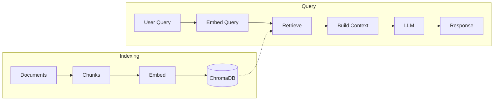

# Chatbot MVP

## About

Personal project: RAG chatbot to explore document Q&A and retrieval. I'm developing it toward secure-coding use (e.g. querying coding standards and eventually checking code for security issues). The current MVP ingests PDFs and markdown and answers from those documents.

## Overview

Lets you ask questions over your own documents and get answers grounded in them. For structured rule sets (e.g. coding standards), it can prioritize the relevant rule when you ask by name (e.g. "What is PRE30-C?"). Built with FastAPI and ChromaDB.

## Requirements

- Python: 3.10–3.12 (uv installs it automatically if needed). 3.14 is not supported: ChromaDB uses Pydantic v1, which is incompatible with 3.14+.
- [uv](https://github.com/astral-sh/uv) – package and environment manager

## Installation

1. Install [uv](https://github.com/astral-sh/uv) (e.g. via the official installer):

   ```sh
   curl -LsSf https://astral.sh/uv/install.sh | sh
   ```

   Then ensure `~/.local/bin` is on your `PATH`, or install with pip: `pip install uv`.

2. From the repo root, create the venv and install dependencies:

   ```sh
   uv sync --extra dev    # creates .venv and installs deps + dev tools (ruff, pyright)
   ```

3. Activate the venv so you can use `python`, `pytest`, etc. without prefixing every command with `uv run`:

   ```sh
   source .venv/bin/activate   # macOS/Linux
   # Windows:  .venv\Scripts\activate
   ```

## Configuration

- Create `.env` file with variables mentioned in [.env.example](./.env.example)

- Use a folder named `source_docs` for your documents, or set the `COLLECTION_PATH` env variable to your folder path. To fetch docs from GitHub into source_docs, run the [github_downloader](./github_downloader/README.md) with a JSON file listing repo URLs: edit `github_downloader/urls.json` then run `python -m github_downloader`.

**Note:** The chatbot accepts any markdown/pdf documents you provide. PDFs are automatically converted to markdown during indexing. The `source_docs` folder is not included in this repository—you must add your own documents.

- The vectordb uses persistent storage (default `./chroma_db`). Override with `PERSISTENT_STORAGE` in `.env` (see [.env.example](./.env.example)).

- File modification times are stored in a JSON file there (default `file_hashes.json`, override `HASH_FILE`) for incremental re-indexing. Format: [sample_file_hashes.json](docs/sample_file_hashes.json).

- Logging goes to standard output by default. Set `LOG_FILE` in `.env` (e.g. `LOG_FILE=chatbot.log`) to write logs to a file.

## Run

With the venv activated (see Installation), from the repo root:

Run with: `python chatbot.py`

Without activating the venv, prefix with `uv run`: `uv run python chatbot.py`

## Run with Docker (local)

From the repo root. One command (build + run, with `.env` and local `source_docs` / `chroma_db` mounted):

```sh
docker compose up
```

Then open http://localhost:8000/ (health) or http://localhost:8000/docs (API docs).

## Adding a new package

From the repo root (venv can be active or not):

```sh
uv add <package-name>
```

This updates `pyproject.toml` and `uv.lock`, and installs the package. Commit both files.

For a dev-only dependency (e.g. a test or lint tool):

```sh
uv add --dev <package-name>
```

To add a version constraint: `uv add "package>=1.0"`. After editing `pyproject.toml` by hand, run `uv lock` to refresh the lockfile.

## Architecture

RAG (Retrieval-Augmented Generation)

**Indexing Phase (One-time setup):**
Documents -> Chunks -> Embeddings + Indexing (VectorDB: ChromaDB)

**Query Phase (Per request):**
User Query -> Embed Query -> Search Vector DB -> Retrieve top X Chunks -> Build prompt (retrieved chunks + user query) -> LLM -> Response



**Components:**

- **Chunking**:
  1. Header-based splitting: Regex-based splitting on any level-2 markdown header (`## `) to preserve semantic boundaries
  2. Recursive character splitting: [langchain_text_splitters.RecursiveCharacterTextSplitter](https://docs.langchain.com/oss/python/integrations/splitters) for further chunking if sections exceed chunk_size (configurable via `CHUNK_SIZE`, `CHUNK_OVERLAP`)
- **Vector Database**: [chromadb](https://github.com/chroma-core/chroma) (embedding and indexing)
- **LLM**: [google-genai](https://github.com/googleapis/python-genai) (Gemini 2.5 Flash)

**Note:**

Docs are loaded from the collection folder at server startup (default `source_docs`, overridable via `COLLECTION_PATH`). Reload when you update docs.

ChromaDB automatically handles tokenization, embedding, and indexing when documents are added via `collection.add()`.

## Sample retrieval

For a rule-specific query, the retrieval pipeline prepends the matching rule chunk (distance 0.0) then fills the rest with semantic search. The example below uses coding-standard documents (e.g. CERT C/C++ rules); you add your own in `source_docs`. Example for "What is PRE30-C?" with `N_RESULTS=50`:

| Step            | Result |
|-----------------|--------|
| Rule boost      | 1 chunk (PRE30-C definition) |
| Semantic search | Top 49 additional chunks (after dedup) |
| Total returned  | 50 chunks; first chunk = PRE30-C (distance 0.0) |

Example `query_summary` (concise): `distances: [0.0, 1.28, 1.33, ...], rules_found_in_chunks: ["PRE30-C"]`. See [sample retrieval output](docs/sample_retrieval_output.md) for a short sanitized log excerpt. The sample uses [SEI CERT C and C++ Coding Standards](https://www.sei.cmu.edu/library/sei-cert-c-and-c-coding-standards/)(2016 editions)

## Future improvement

### Core Stability

- **Distance-based filtering**: Use the distance returned by get_query_results in get_context (e.g. only include chunks with distance below a threshold, or within a narrow range)
- **Better error handling:** Add logging and retry logic for API calls

### Code Analysis (Core Value)

- **Code input endpoint**: Add `/analyze_code` endpoint for semantic code → rule retrieval (no AST parsing needed)
- **42 Integration**: Test against personal C projects and document security findings
- **Security report generation**: CLI tool to scan code and output markdown security reports

### Future (When Needed)

- **Metadata filtering**: Extend filtering using ChromaDB's `where` clause for source, date, or other metadata
- **Document automation**: Automate document updates and indexing (e.g., watch for new PDF releases)
- **Production optimizations**: Vector DB migration, performance improvements (only when real users exist)

## API Documentation

FastAPI automatically generates interactive API documentation:

- Swagger UI: http://127.0.0.1:8000/docs
- ReDoc: http://127.0.0.1:8000/redoc

## Testing

1. Start the server: `python chatbot.py` (or `uv run python chatbot.py` if the venv is not activated)

2. In another terminal, test the health endpoint:

```bash
./curl_scripts/test_health.sh
```

3. Test a conversation:

```bash
./curl_scripts/test_chatbot.sh
```

or run multiple tests:

```bash
./curl_scripts/tests.sh
```

## Files Reference

- Main implementation: [chatbot.py](chatbot.py) – FastAPI app. RAG and vector DB in the [chroma/](chroma/) package
- Configuration: [pyproject.toml](pyproject.toml), [uv.lock](uv.lock), [.env.example](.env.example)
- Packages
  - [chroma/](chroma/) - ChromaDB client implementation with vector database operations
  - [github_downloader/](github_downloader/) - see [github_downloader/README.md](./github_downloader/README.md)
- Scripts: [scripts/](scripts/)
  - [reload_db.py](scripts/reload_db.py) - script to reload Chroma collection. Run: `python -m scripts.reload_db` (or `uv run python -m scripts.reload_db` without venv)
  - [remove_db_files.py](scripts/remove_db_files.py) - script to remove file from Chroma collection. Run: `python -m scripts.remove_db_files` (or `uv run python -m scripts.remove_db_files` without venv)
- Curl scripts: [curl_scripts/](curl_scripts/)
  - [test_health.sh](curl_scripts/test_health.sh) – Test GET / endpoint
  - [test_chatbot.sh](curl_scripts/test_chatbot.sh) - Test POST /chat endpoint
  - [tests.sh](curl_scripts/tests.sh) - Multiple tests POST /chat endpoint
