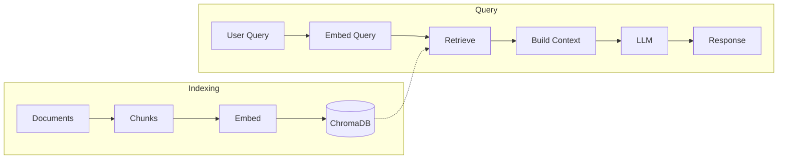

# Chatbot MVP

## About

Personal project: RAG chatbot to explore document Q&A and retrieval. I'm developing it toward secure-coding use (e.g. querying coding standards and eventually checking code for security issues). The current MVP ingests PDFs and markdown and answers from those documents.

## Overview

Lets you ask questions over your own documents and get answers grounded in them. For structured rule sets (e.g. coding standards), it can prioritize the relevant rule when you ask by name (e.g. "What is PRE30-C?"). Built with FastAPI and ChromaDB.

## Requirements

- Python: Version 3.10 - 3.12
- Dependencies: Check [requirements.txt](./requirements.txt)

## Installation
Make sure you create a virtual environment, activate it, and then install all dependencies mentioned in `requirements.txt`

```sh
python -m venv .venv    # create venv
source .venv/bin/activate   # activate venv

pip install -r requirements.txt # install dependencies
```

## Configuration:

- Create `.env` file with variables mentioned in [.env.example](./.env.example)

- Use a folder named `source_docs` for your documents, or set the `COLLECTION_PATH` env variable to your folder path.

**Note:** The chatbot accepts any markdown/pdf documents you provide. PDFs are automatically converted to markdown during indexing. The `source_docs` folder is not included in this repository—you must add your own documents. 

- The vectordb uses persistent storage. The default path is `./chroma_db`, if needed, override it by setting `PERSISTENT_STORAGE` in `.env` (see [.env.example](./.env.example))

## Run
To run programmatically:
`python chatbot.py`

To run via CLI (non-programmatically):
`fastapi dev chatbot.py`
or
`uvicorn chatbot:app --reload`

## Architecture

RAG (Retrieval-Augmented Generation)

**Indexing Phase (One-time setup):**
Documents -> Chunks -> Embeddings + Indexing (VectorDB: ChromaDB)

**Query Phase (Per request):**
User Query -> Embed Query -> Search Vector DB -> Retrieve top X Chunks -> Build prompt (retrieved chunks + user query) -> LLM -> Response



**Components:**
- **Chunking**: [langchain_text_splitters.RecursiveCharacterTextSplitter](https://docs.langchain.com/oss/python/integrations/splitters) (configurable via CHUNK_SIZE, CHUNK_OVERLAP)
- **Vector Database**: [chromadb](https://github.com/chroma-core/chroma) (embedding and indexing)
- **LLM**: [google-genai](https://github.com/googleapis/python-genai) (Gemini 2.5 Flash)

**Note:** 

Indexing new documents can be done via the `/index_docs` API endpoint. Loading/reloading docs from the collection folder (default `source_docs`, overridable via `COLLECTION_PATH`) is necessary on server startup or when documents are updated.

ChromaDB automatically handles tokenization, embedding, and indexing when documents are added via `collection.add()`.

## Sample retrieval

For a rule-specific query, the retrieval pipeline prepends the matching rule chunk (distance 0.0) then fills the rest with semantic search. The example below uses coding-standard documents (e.g. CERT C/C++ rules); you add your own in `source_docs`. Example for "What is PRE30-C?" with `N_RESULTS=5`:

| Step            | Result |
|-----------------|--------|
| Rule boost      | 1 chunk (PRE30-C definition) |
| Semantic search | Top 4 additional chunks (after dedup) |
| Total returned  | 5 chunks; first chunk = PRE30-C (distance 0.0) |

Example `query_summary` (concise): `distances: [0.0, 1.28, 1.33, ...], rules_found_in_chunks: ["PRE30-C"]`. See [sample retrieval output](docs/sample_retrieval_output.md) for a short sanitized log excerpt. The sample uses [SEI CERT C and C++ Coding Standards](https://www.sei.cmu.edu/library/sei-cert-c-and-c-coding-standards/)(2016 editions)

## Future improvement:
- **Source data:** Replace SEI CERT with open source data: OWASP, CWE, NIST, CISA
- **Metadata filtering**: Extend filtering (using ChromaDB's `where` clause to filter by source, date, or other metadata) in addition to current rule_id filter. See [Chroma Metadata Filtering](https://docs.trychroma.com/docs/querying-collections/metadata-filtering)
- **Distance-based filtering**: Use the distance returned by get_query_results in get_context (e.g. only include chunks with distance below a threshold, or within a narrow range)
- **Indexing / ingestion performance:** Speed up PDF to markdown conversion, chunking, and single-document add to the vector DB (with parallel processing, caching, or incremental indexing).
- **Persistent file hashes**: Store file modification time hashes in JSON file instead of in-memory `RagClient.file_hashes` to survive server restarts and enable incremental indexing across restarts
- **Better error handling:** Add logging and retry logic for API calls
- **Production vector DB**: Consider Qdrant, or other vector DBs for production deployment
- **Production deployment**: Remove endpoints (`/index_docs`, `/reload_docs`, `/chat_test`) from public API and replace with CLI scripts for server-side operations
- **Document automation**: Automate document updates and indexing (e.g. watch for new PDF releases, download and index automatically, use date metadata to prioritize recent documents)

## API Documentation

FastAPI automatically generates interactive API documentation:
- Swagger UI: http://127.0.0.1:8000/docs
- ReDoc: http://127.0.0.1:8000/redoc

### GET /

Health check endpoint.

**Response:**
```json
{
  "message": "Hello World"
}
```

### POST /chat

Send a message to the chatbot.

**Request:**
```json
{
  "message": "What is PRE30-C?",
  "session_id": 1
}
```

**Response:**
```json
{
  "reply": "Based on the provided context, \"-C\" in \"PRE30-C\" indicates that it pertains to the C programming language. While the specific meaning of \"PRE30\" is not detailed, the document discusses coding standards, guidelines, and noncompliant code examples, suggesting that \"PRE30-C\" is likely a specific guideline or rule within a C coding standard."
}
```

**Request schema:**
  `message` (string) – user's message.
  `session_id` (integer) – session identifier for conversation tracking.

**Response schema:**
  `reply` (string) – bot's response message generated using RAG.

### POST /reload_docs

Load or re-load all docs from the collection folder (default `source_docs`, see `COLLECTION_PATH`) without restarting the server.

### POST /index_docs

Index docs without restarting the server

**Request:**
```json
{
  "files": ["docs/example.md"]
}
```

**Response:**
```json
{
  "message": "Documents indexed successfully",
  "files_indexed": ["docs/example.md", "docs/notes.md"],
  "errors": []
}
```

**Request schema:**
  `files` (array of strings) – list of file paths to index.

**Response schema:**
  `message` (string) – status message.
  `files_indexed` (array of strings) – successfully indexed files.
  `errors` (array of strings) – any errors encountered.

## Testing

1. Start the server using `python chatbot.py`

2. In another terminal, test the health endpoint:
```bash
./curl_scripts/test_health.sh
```

3. Index documents:
```bash
./curl_scripts/index_files.sh
```

4. Test a conversation:
```bash
./curl_scripts/test_chatbot.sh
```

or run multiple tests:
```bash
./curl_scripts/tests.sh
```

or manually:
```bash
curl -X POST http://127.0.0.1:8000/chat \
  -H "Content-Type: application/json" \
  -d '{"message": "What is PRE30-C?", "session_id": 1}'
```

## Files Reference
- Main implementation: [chatbot.py](./chatbot.py) – FastAPI app and RAG logic
- ChromaDB client implementation: [chroma.py](./chroma.py) – Vector database operations
- Configuration: [requirements.txt](./requirements.txt), [.env.example](./.env.example)
- Curl scripts: [curl_scripts/](./curl_scripts/)
  - [test_health.sh](./curl_scripts/test_health.sh) – Test GET / endpoint
  - [test_chatbot.sh](./curl_scripts/test_chatbot.sh) - Test POST /chat endpoint
  - [tests.sh](./curl_scripts/tests.sh) - Multiple tests POST /chat endpoint
  - [reload_docs.sh](./curl_scripts/reload_docs.sh) - Load/reload documents via POST /reload_docs endpoint
  - [index_files.sh](./curl_scripts/index_files.sh) - Index documents via POST /index_docs endpoint
